# Amir Lahlou

MSc Robotics student at EPFL (Lausanne), BSc in Microengineering. I like building physical systems: mechanics, electronics, control, and the simulation work that comes before building. What I want to work on next is taking manual processes and automating them end to end, so the line runs without operators: study the process, pick standard components, design what has to be custom, commission it, keep it running.

**Looking for an internship in industrial automation solutions from February 2027**, six months or longer. It can also run as a 25-week EPFL master project if the topic fits.

[CV (PDF)](CV_Amir_Lahlou.pdf) · [LinkedIn](https://www.linkedin.com/in/amir-lahlou-926b243b1/) · amir.lahlou@epfl.ch

---

## Master semester project, ongoing: gaze-guided shared autonomy (Idiap Research Institute, HRAI group, autumn 2026)

Supervised by Dr. Emmanuel Senft and Prof. Jean-Marc Odobez. The group has a joystick-based shared-autonomy framework; I am extending it with the operator's gaze. Gaze and joystick are fused into a belief over candidate targets, so the robot infers the intended target earlier and scales its assistance to its confidence. Gaze runs about half a second ahead of the hand, but looking is not wanting (Midas touch: people also fixate what they avoid or monitor), so it is treated as a weak observation of intent rather than a command, and the joystick keeps a veto.

---

## Bimanual robotic cell for textile assembly (personal project, simulation, 2026 – present)

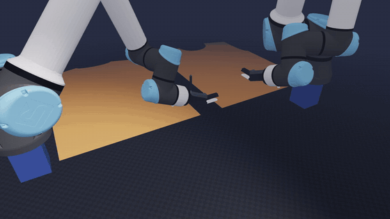

GPU physics simulation (Newton) of two UR5e arms handling T-shirt panels: the front panel is laid onto the back panel, then the seam between them is simulated.

The fabric is modelled as deformable bodies, with contact between fabric and grippers. The seam is a series of kinematic constraints laid down progressively along the edge, with no thread mechanics on purpose: the interesting problem is getting the two panels to line up, not the stitch. Alignment is scored with a residual measured just before the seam is closed. Measuring it after would let the seam pull the edges into place and flatter the number. Arm control and a teleoperation interface drive both arms in Cartesian space.

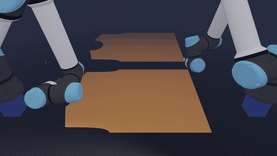

Code private.

---

## Perching glider (master semester project, CVLab, autumn 2025)

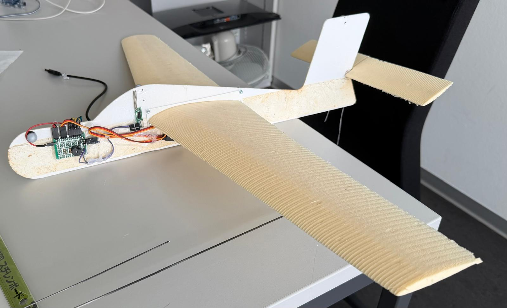

A 150 g fixed-wing glider built as a test platform for perching maneuvers, supervised by Prof. Pascal Fua. Wing sizing came from a low-Reynolds-number analysis (modular NACA 4412 wings), then CAD, then the physical airframe. I also did the onboard electronics, two microcontrollers and a radio link, and the wireless interface between ground command and the aircraft, which drives pitch actuation.

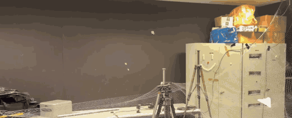

Flight test: hand launch, a few metres of glide, then the net.

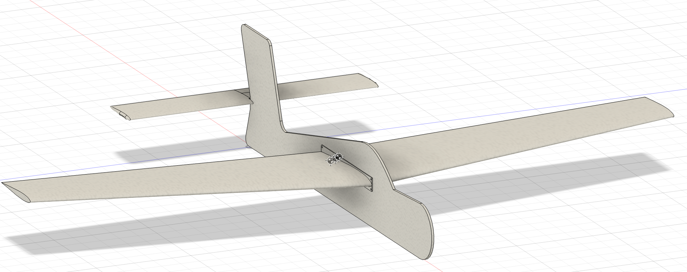
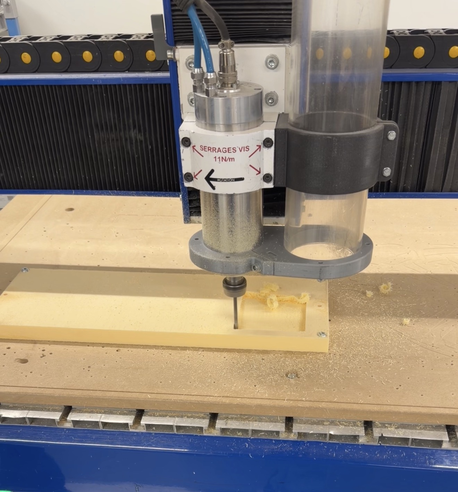

[Project report (PDF, 23 pages)](assets/planeur/glider_report.pdf)

---

## Course projects

### 3-axis Cartesian machine (MICRO-451, spring 2026)

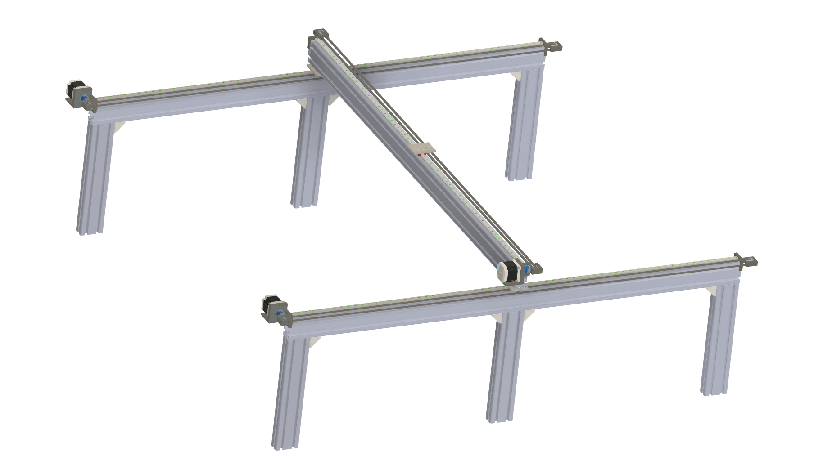
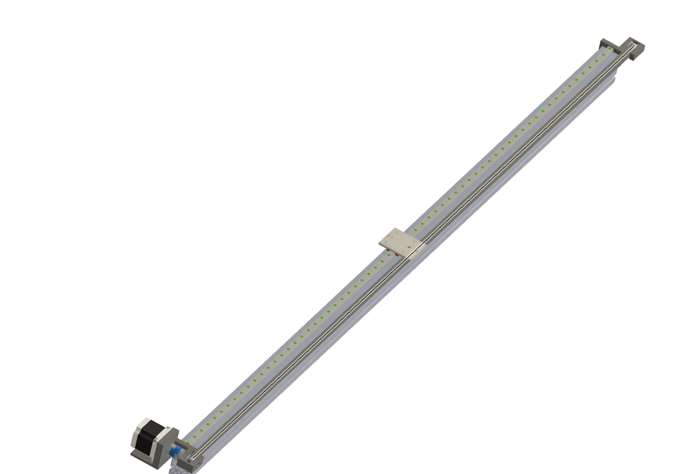

Size a large-format three-axis Cartesian machine from the loads down to the motors, then model it. Linear rails, GT2 belt drives, an aluminium T-slot frame with a crossbeam, and a dual-motor X axis on open-loop steppers. Open loop is a deliberate choice: for a ±1 mm target, steppers with a 2x torque margin are the standard solution at this size, and re-homing at the start of each cycle stops lost steps from accumulating from one cycle to the next. A worst-case accuracy budget was checked against the target. The full mechanism is modelled in Fusion 360 (rails, carriages, crossbeam, belt clamps, brackets, motor mounts), and the design report goes with it. Known limitations, from the course review and my own re-read:

- The six legs are not braced to each other and have no levelling screws, so the frame relies on the base plates and on the floor being flat. Next revision: lower beams tying the feet together, adjustable feet.
- The motor coupling is an Oldham, which wears and is not the right choice for position control. Next revision: a bellows coupling.
- There is no belt tensioner: the idler axle and the motor shaft are both fixed, so the preload cannot be set or maintained. Next revision: idler on a slotted yoke.

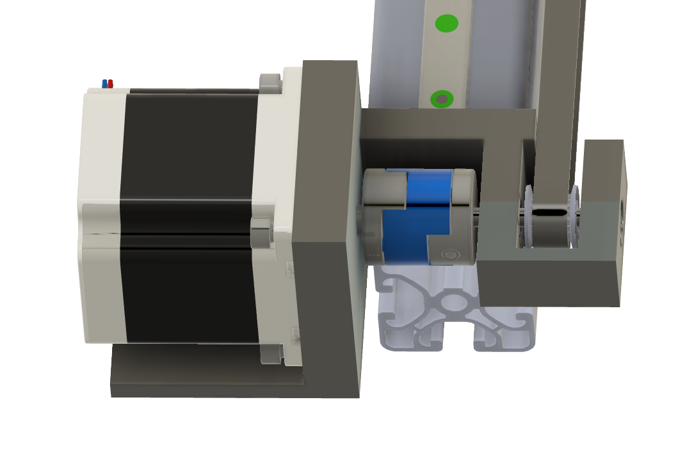
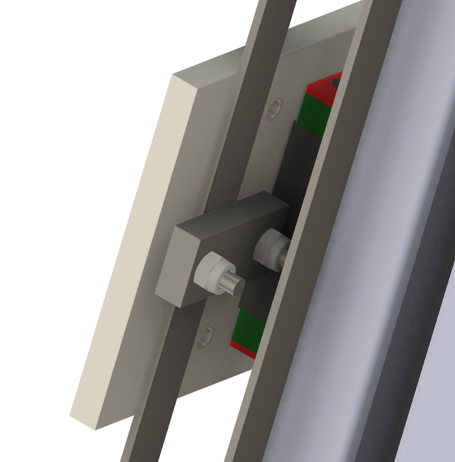

### Rocket landing with model predictive control (ME-425, spring 2026)

MPC controllers in Python for a 12-state thrust-vector-controlled rocket: linear MPC on decomposed subsystems with terminal invariant sets, trajectory tracking, offset-free control under model mismatch, and nonlinear MPC on the full model. The animation is the nonlinear MPC bringing the rocket from (3, 2, 10) m with a 30-degree roll to the target at (1, 0, 3) m, in real time. Project done with Ilyas Asmouki.

[Code, notebooks and report on GitHub](https://github.com/amirlh/rocket-mpc) · [video (MP4)](assets/mpc/rocket_landing_nmpc.mp4)

### Imitation learning benchmark (EE-568, spring 2026)

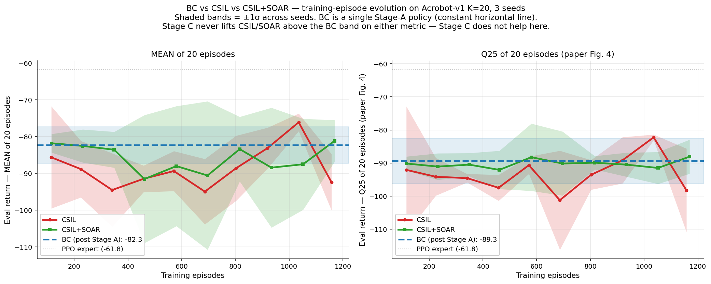

Reimplemented CSIL and SOAR from the original papers and measured how their sample efficiency changes with the number of expert demonstrations, on Gymnasium control tasks.

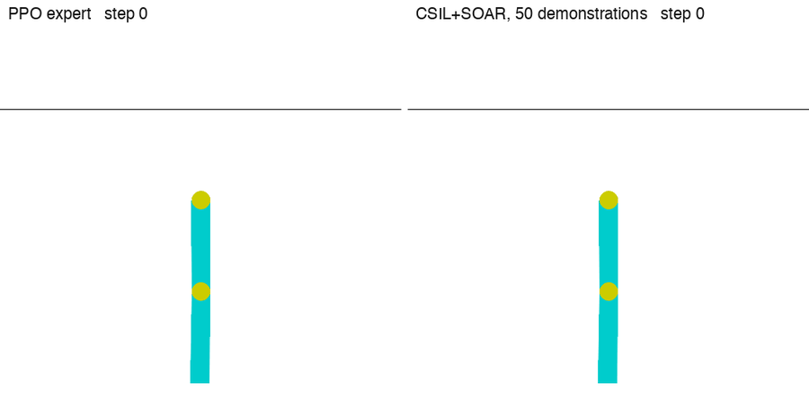

PPO expert on the left, imitation policy on the right, same evaluation seed. CartPole is learned from a single expert demonstration and holds the pole for the full 500 steps; Acrobot, from 50 demonstrations, swings up in about as many steps as the expert.

[Code, videos and report on GitHub](https://github.com/amirlh/csil-soar-benchmark)

---

## Associations

### Xplore EPFL, Mars Rover Challenge (2024 – 2025)

*Project Manager & Electrical Engineer*

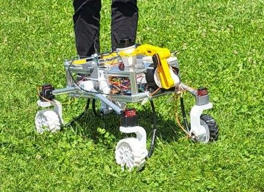

The rover on the grass during a test on campus.

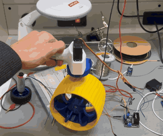
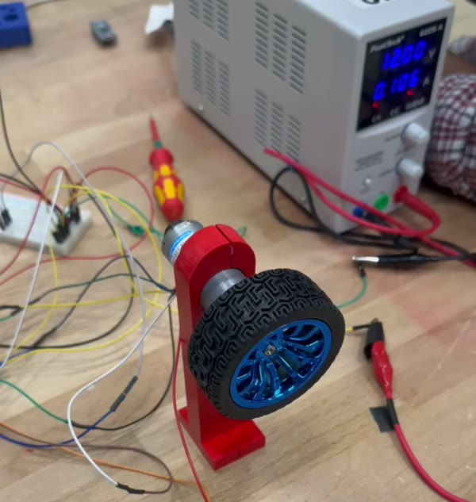

Left: a wheel module tried by hand on the bench, steering servo on top, printed hub. Right: a drive motor on its printed test mount, running from the bench supply.

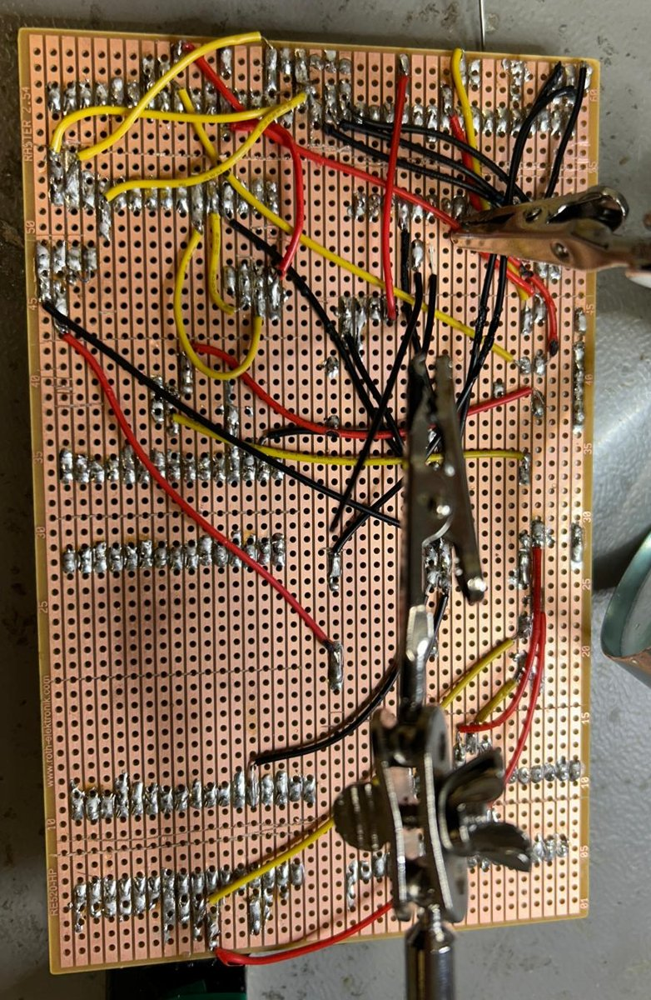
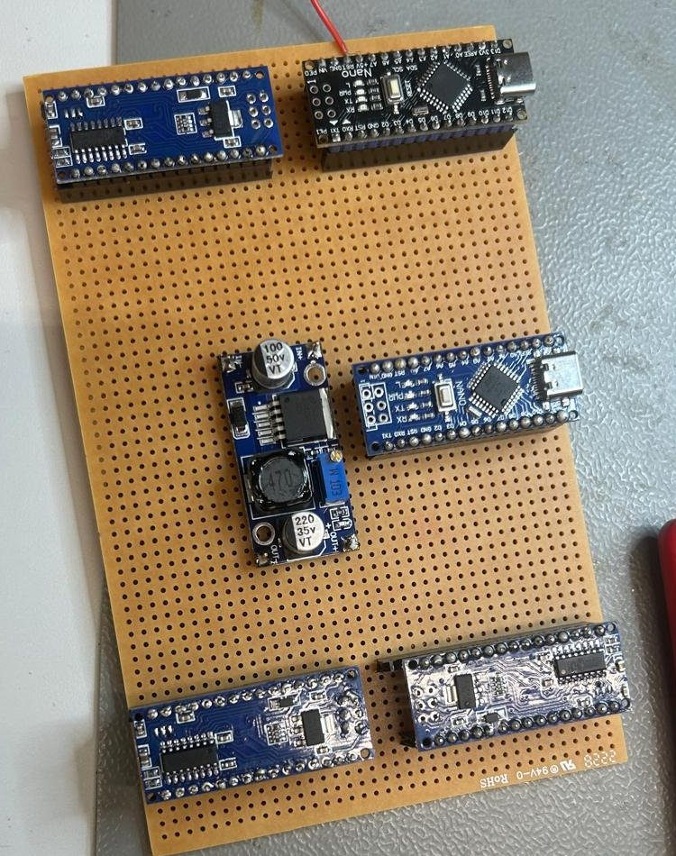

Electronics, before the PCBs: a hand-wired prototype on stripboard, and the layout of the microcontroller boards and step-down converter on perfboard.

Team of 7. I ran the project and coordinated the mechanical, electrical and software work, and I owned the electronics: PCBs for the embedded subsystems, the power management system (distribution, protections, monitoring), PID tuning of the motion controllers, and the I²C link between sensors, actuators and the microcontroller.

### EPFL Racing Team, embedded sensor system (2022 – 2023)

Compact embedded data-acquisition system for a Formula Student car: sensor fusion, real-time logging, performance analysis.

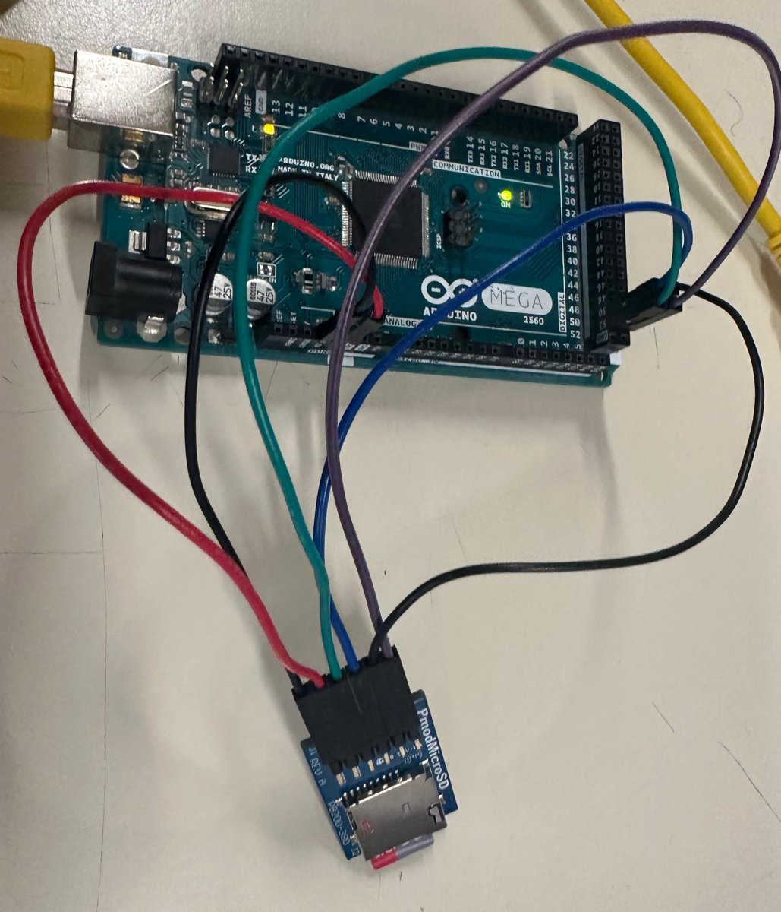
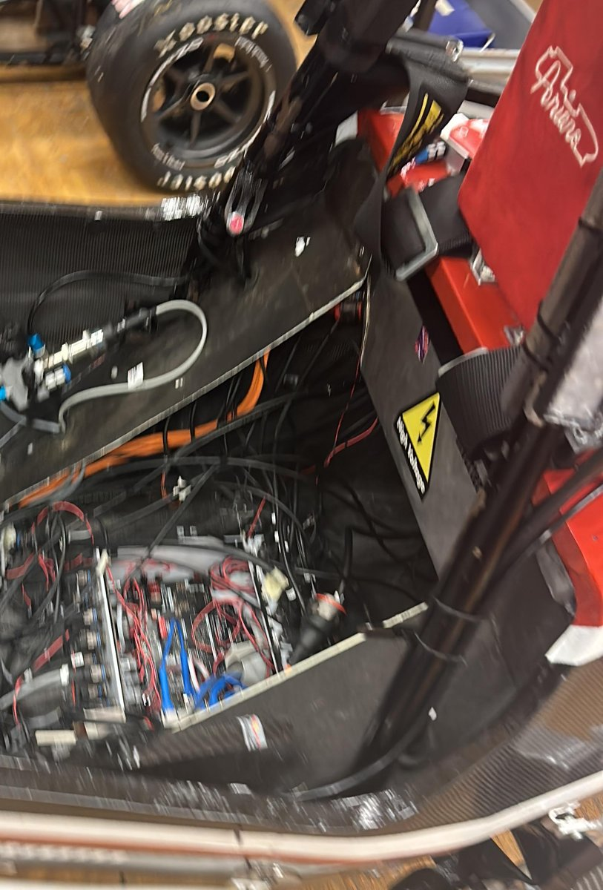

Left: first logging test on the bench, an Arduino Mega writing to a microSD module. Right: the car's electronics bay.

